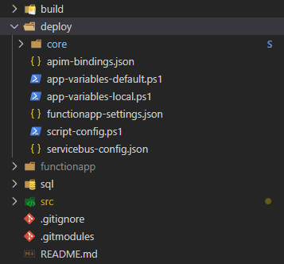

# Introduction

A collection of scripts to assist with;

- the creation of deployment pipelines for applications
- setting up your local development environment

# Usage

## Prerequisites

### Powershell Modules

Powershell Modules should be installed for _AllUsers_ which requires installing them as an Administrator to avoid issues running scripts when connected via the VPN.

[Az Powershell Module](https://docs.microsoft.com/en-us/powershell/azure/install-az-ps?view=azps-3.5.0)

### Product Infrastructure

The application pipeline assumes that;

1.The required product level infrastructure exists, preferably using a repo and pipeline based on [foundry-core/product-infrastructure](https://dev.azure.com/cpu-digital-foundry/foundry-core/_git/product-infrastructure?path=%2FREADME.md&_a=preview).

This will ensure that product level resources; a SQL Server, Storage Account, and App Service Plan have been created. Most applications will have a dependency on at least one of those resources.

## Getting Started

### 1. Add the core git sub-module to your application repository

This repository is intended to be added as a [submodule](https://git-scm.com/book/en/v2/Git-Tools-Submodules) to the repository containing your application code. The submodule can be added to your repository wherever you like and named as you see fit, however the convention used in the scripts and the samples in this documentation assumes the submodule is added with the name _'core'_ in a _'deploy'_ folder in the root of your repository:

From the root of your application repository;

```bash
md deploy
cd deploy

git submodule add https://cpu-digital-foundry@dev.azure.com/cpu-digital-foundry/foundry-core/_git/application-deployment core

git submodule update --init --recursive
```

### 2. Final Project Structure

The following steps walkthrough the various configuration files that need to be created to configure your pipeline.  Depending on your infrastructure requirements; SQL, ServiceBus, etc, your final project structure may be different:



All of the core deployment scripts can be found in the deploy/core folder of your repository.

If you follow the default script conventions and locations, any project specific configuration and scripts should be created in the deploy folder of your repository.  Samples of each of the files listed in the table below can be found in the deploy/core/samples/scripts' folder of your repository to help you get started.

| File Name | Description |
| - | - |
| script-config.ps1 | defines core application attributes; application name, product name, product code, and line of business. |
| app-variables-*.ps1 | Defines the 'default' and 'environment' specific variables for your application. |
| functionapp-settings.json | Defines the application settings to create during deployment.  These can reference Key Vault secrets by secret name.  Some settings are created by default and **DO NOT** need to be configured. See [functionapp-configure-settings.ps1](docs/functionapp-configure-settings.md) for more information. |
| other *.json | The configuration files associated with application integrations; ServiceBus, API Management, etc.  See [scripts](#ScriptReference) below for details. |

### 3. Setup script-config.json

A [script-config.json](docs/script-configuration.md) file must be present and updated with the application specific values.

### 4. Variable Overrides for your Local Environment

_'local'_ is the default environment across all the [scripts](#ScriptReference) making it easier for engineers to run these scripts to setup infrastructure for local development.  

The [SQL deployment](docs/sql-deploy-scripts.md) and [Service Bus Configuration](docs/servicebus-configure.md) scripts will be the most commonly used scripts to setup the required local development infrastructure.

The values defined in the [core variables list](docs/app-variables-core.md) are sufficient for most environments, but some value overrides are required for local development.

#### 4a. Create _'local'_ environment variable overrides

> A pre-configured local variables override file can be found in the _'samples'_ folder of this repo.  
> This overrides the variables required to run these scripts to setup your local development environment.

1. Create a _'app-variables-local.ps1'_ file in the \$CustomScriptPath (this is the _'deploy'_ created above by default)
2. Override the following variables with values below;

   ``` powershell
   ${product-ServiceBusName} = "cpudigitalfoundry-$env:UserName"
   ${product-ServiceBusResourceGroup} = "rg-dev-$env:UserName"
   ${product-ResourceGroup} = "rg-dev-$env:UserName"

   ${app-DbRoleServiceUsersMember} = "NotSet"
   ```

### 5. [MIGRATION ONLY] Yaml Pipeline Migration Guide

> Only applicable if you are migrating from an existing yaml pipeline based on the original Digital Foundry scripts.

A handy [migration guide](https://computershare.sharepoint.com/sites/DigitalF/_layouts/15/Doc.aspx?sourcedoc=%7B1F1E28F8-5816-4E2E-9DB6-3F4F7B2FFDD8%7D&file=FunctionApp-DeployMigrationToPowershell.docx&action=default&mobileredirect=true) exists to help you with the migration of your existing yaml pipeline to these deployment scripts.

## Upgrading

Refer to the latest [release notes](RELEASE_NOTES.md) to review the changes and determine if upgrading to a newer version of the deployment scripts is necessary and/or safe.

Then from the root of your application repository;

```bash
cd deploy/core

git pull

git checkout [master|branch|tag]
```

Where \[master|branch|versionTag\] is the master branch, development branch, or tag you want to use.  In most cases this will either be master (the latest available scripts), or a specific version tag taken from the [release notes](RELEASE_NOTES.md).  If you're working on changes to these scripts you may want to reference a development branch for testing or debugging purposes.

# Script Reference

[Script Configuration](docs/script-configuration.md)

[Common Script Parameters](docs/common-script-parameters.md)

[app-deploy.ps1](docs/app-deploy.md)
a script wrapper to;

- use as an entry point for an Azure DevOps Release pipeline
- test a full end-to-end deployment locally

[app-variables-core.ps1](docs/app-variables-core.md)
a list of the variables used in the scripts below

[functionapp-create.ps1](docs/functionapp-create.md)
creates a new, empty functionapp in Azure

[functionapp-create-slot.ps1](docs/functionapp-create-slot.md)
creates a new, functionapp slot in Azure

[functionapp-swap-slot.ps1](docs/functionapp-swap-slot.md)
swaps functionapp slots in Azure

[sql-deploy-scripts.ps1](docs/sql-deploy-scripts.md)
deploys sql scripts against a local or Azure based SQL server

[functionapp-configure-settings.ps1](docs/functionapp-configure-settings.md)
configures functionapp settings, supports explicit values and key vault references

[servicebus-configure.ps1](docs/servicebus-configure.md)
creates or deletes queues, topics, and subscriptions in an Azure ServiceBus

[functionapp-deploy.ps1](docs/functionapp-deploy.md)
deploys the functionapp build artifact to Azure using zip deploy, also supports _'slot'_ deployments

[functionapp-bind-apim.ps1](docs/functionapp-bind-apim.md)
binds the http trigger methods in a function app to the corresponding API operations in Azure API Management

[alert-rule-create.ps1](docs/alert-rule-create.md)
create an alert rule in Azure

[OPTIONAL: app-custom-script.ps1](docs/app-custom-script.md)
allows apps to provide custom steps to be executed in a pipeline

# Contribute

Any changes made to the submodule in your repository will need to be merged back into the _'foundry-core/application-deployment'_ before they can be used in a pipeline. This should be done via the usual PR process and can be done from within the submodule.
