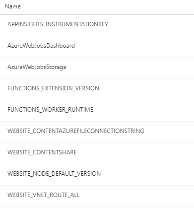

# configure-functionapp-settings.ps1

> Used to configure an Azure FunctionApp or Slot

## Parameters

This script supports the [Common Script Parameters](common-script-parameters.md)

## Variables

The following variables are used in this script. The values are defined in the core variables but can be overridden at the application or environment level, see [app-variables-core](app-variables-core.md) for more information.

| Name                        | Default Value                                                                                  | Description                                                                                                                     |
| --------------------------- | ---------------------------------------------------------------------------------------------- | ------------------------------------------------------------------------------------------------------------------------------- |
| \${app-DeploymentSlot}      | unstable                                                                                       | slot processing is ignored when _'\${app-DeploymentSlot}'_ = _'production'_                                                     |
| \${product-FunctionAppName} | ${config-ShortLineOfBusiness}$ShortEnvironment-${config-ProductName}-${config-ApplicationName} | the name of the function app                                                                                                    |
| \${product-KeyVaultName}    | ${config-ShortLineOfBusiness}$ShortEnvironment-\${config-ProductName}-kv                       | the function app is given access the read the secrets in this key vault. Holds product secrets, various connection strings, etc |
| \${product-ResourceGroup}   | rg-${config-ShortLineOfBusiness}$ShortEnvironment-\${config-ProductName}                       | the resource group for application resources                                                                                    |

## Description

The script reads a list of Function App configuration values from _\$RootPath/deploy/functionapp-settings.json_ and applies them to the Function App (if \${app-DeploymentSlot} = 'production') or Deployment Slot.

The configuration values can use static text value, or they can be retrieved from secrets stored in the \${product-KeyVaultName}.

### Default Settings

The following Function App configuration settings are created by default and do not need to be configured for each application.



## Examples

### 1. Create static configuration values

_\$RootPath/deploy/functionapp-settings.json_

```json
{
  "settings": [
    {
      "name": "MySetting",
      "value": "MySettingValue"
    },
    {
      "name": "AnotherSetting",
      "value": "AnotherValue"
    }
  ]
}
```

```powershell
.\deploy\core\scripts\functionapp-create-slot.ps1
```

### 2. Create configuration values from Key Vault

When isKeyVaultReference is set to true, the setting value is the name of a secret found in the \${product-KeyVaultName} Key Vault.

_\$RootPath/deploy/functionapp-settings.json_

```json
{
  "settings": [
    {
      "name": "ServiceBusConnection",
      "value": "dfdev-servicebus-connectionstring",
      "isKeyVaultReference": true
    },
    {
      "name": "SqlConnectionString",
      "value": "dfdev-sample-sql-connectionstring",
      "isKeyVaultReference": true
    }
  ]
}
```

```powershell
.\deploy\core\scripts\functionapp-create-slot.ps1
```

### 3. Create configuration values from static entries and Key Vault

When isKeyVaultReference is set to true, the setting value is the name of a secret found in the \${product-KeyVaultName} Key Vault.

_\$RootPath/deploy/functionapp-settings.json_

```json
{
  "settings": [
    {
      "name": "MySetting",
      "value": "MySettingValue"
    },
    {
      "name": "SqlConnectionString",
      "value": "dfdev-sample-sql-connectionstring",
      "isKeyVaultReference": true
    }
  ]
}
```

```powershell
.\deploy\core\scripts\functionapp-create-slot.ps1
```
